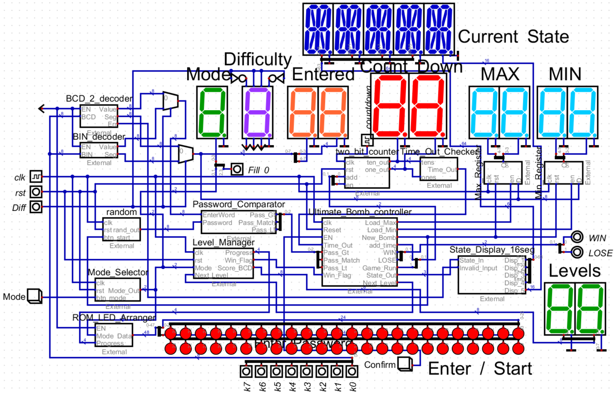

# 數位邏輯設計實習期末專題：拆彈遊戲

## 簡介

114-2 學年度電機系數位邏輯設計實習期末專題，以[Digital](https://github.com/hneemann/digital)模擬電路製作而成，結合拆彈遊戲與終極密碼玩法，催生了這次的複合式數位邏輯遊戲。

[Digital Game File](./Digital/Ultimate_Bomb.dig)

指導教授： 吳昭正 副教授

## 組員與分工

|學號|班級|姓名|負責單元|
|----|----|----|----|
|111310452|電機四甲|黃安華|狀態機、解碼器、比較器、輸出單元|
|112310456|電機三乙|林岑芝|亂數產生器、倒數計時器、記憶單元|

註：此分工表僅供參考，因部分功能原本是合在一起的，之後為了讓電路更簡潔與完善功能才將功能拆分至其他元件中，因此最後各自與原分工相關的元件數量可能不同。

## 專題設計巧思

- **模組化與解耦架構 (Modular & Decoupled Architecture)**：

遵循計算機結構標準，將整個系統劃分為控制單元 (Control Unit)、記憶單元 (Memory Unit)、運算邏輯單元 (ALU) 與輸出單元 (Output Unit)。將「關卡計數器」從主狀態機中抽離成獨立的 `Level_Manager`，降低狀態機複雜度。
- **硬體運算與防呆機制 (Hardware Datapath & Error Handling)**：

密碼比對並非依賴軟體邏輯，而是建立純硬體的密碼比較器 (`Password_Comparator`) 來輸出大於、小於的狀態訊號。系統更內建完整的防呆邏輯，能自動攔截超出當前上下限的無效數字與不合法的 BCD 碼 (`A~F`)，避免玩家因誤觸而導致遊戲異常。
- **利用 ERROR 數字狀態製作作弊模式 (Cheat Mode by Invalid State)**：

利用 BCD 碼的無效輸入值作為硬體觸發條件，只要玩家在指撥開關輸入 `AA`，即可啟動「作弊模式」，透過多工器將畫面上顯示的關卡數量顯示器強制切換為「當局炸彈的正確密碼」。

## 遊戲規則
本專題結合了經典的「終極密碼」與「定時炸彈」機制，核心規則如下：
1. **遊戲目標**：在倒數計時歸零前，找出炸彈的正確兩位數密碼（00~99）來成功拆彈。
2. **極限縮圈**：每次輸入猜測數字後，系統會自動比對。如果猜錯，系統會根據猜測值自動更新「上限（Max）」或「下限（Min）」，讓可猜測的區間越來越小。
3. **生死時速**：倒數計時器會不斷扣秒，給予玩家壓迫感。成功拆除一顆炸彈後，系統會根據當前難度給予獎勵時間 (入門+30秒、進階與無盡+20秒、挑戰+10秒)。
4. **勝負判定**：
   - **勝利**：若在時間內拆除該模式指定數量的炸彈，遊戲結束並顯示「WIN」。
   - **失敗**：若倒數歸零前未能猜出當前密碼，炸彈將引爆，遊戲結束並顯示「LOSE」。

## 遊戲流程
### 遊戲開始：

透過 Diff 選擇遊戲難度(輸入模式)，共有兩種輸入方式：
* **BCD碼輸入**：玩家使用獨立的鍵盤按鍵輸入十進位數字，直觀但挑戰性較低，適合新手玩家。
* **BIN碼輸入**：玩家必須透過開關直接撥出 8-bit 的二進位數值（例如 `0101 1001` 代表 89），考驗玩家在時間壓力下的進位轉換與心算能力，適合硬核玩家。

透過 Mode_BTN (模式切換按鍵) 設定遊戲模式，共有四種模式：
* **入門模式**：共需解鎖 3 個關卡。
* **進階模式**：共需解鎖 6 個關卡。
* **挑戰模式**：共需解鎖 12 個關卡。
* **無盡模式**：無關卡數限制，解鎖越多關卡越好。

### 遊戲流程 (How to Play)

1. **初始化與待機 (IDLE)**：開機後進入待機模式，此時顯示器會顯示 `IDLE`。玩家可透過 `Mode_BTN` 設定好遊戲模式 (Mode)，以及透過開關設定難度 (Diff) 後，按下 `Confirm` 鍵開始遊戲。
2. **生成炸彈密碼 (NEXT BOMB)**：系統會透過硬體亂數產生器，隨機生成一個 00~99 的目標密碼，並將猜測上下限重置為 00 與 99。此時狀態顯示器會閃爍 `NEXT`，玩家須按下 `Enter` 鍵正式進入生死倒數。
3. **生死倒數 (GAME / INPUT)**：
   - 倒數計時器開始每秒扣減時間。
   - 玩家必須在時間歸零前，根據顯示器上的「上下限提示」推測出炸彈的正確密碼。
   - 輸入猜測的數字後，按下 `Enter` 鍵剪線。
4. **極限縮圈 (CHECK PASS)**：
   - **猜錯了**：如果猜錯，範圍會越來越小，若猜測值大於目標，上限 (`Max`) 將被更新；若小於目標，下限 (`Min`) 將被更新。
   - **防呆機制**：若玩家不小心輸入超過當前上下限的無效數字，或是輸入不合法的 BCD 碼 (如 A~F)，系統會自動攔截並顯示 `ERROR` 警告，不會更新範圍。
5. **拆彈成功 (BONUS TIME / WIN)**：
   - **猜中密碼**：成功拆除該顆炸彈時，系統會自動發放獎勵時間 (Bonus Time) 將倒數時間加 30 秒，並結算關卡進度。
   - 如果達到該模式的通關要求，遊戲勝利，畫面將顯示 ` WIN `！
   - 否則，將進入下一顆炸彈的生成階段。 
6. **爆炸失敗 (BOOM / LOSE)**：若倒數時間歸零時仍未猜出正確密碼，炸彈無情引爆，畫面顯示 `LOSE`，遊戲宣告結束。

## 電路設計
[流程圖](./FlowChart.png)
[電路架構](./Structure.md)
[SM Chart](./smchart.md)
[SM Chart TXT](./smchart(gemini).txt)
[狀態圖](./StateDiagram.md)

## 遊戲元件與功能

### 控制單元
- **遊戲控制器（Game Controller）** - [Ultimate_Bomb_controller.vhdl](./Control_Unit/Ultimate_Bomb_controller.vhdl)：

  整個系統的大腦（核心 FSM 狀態機），負責協調整個遊戲流程。依據目前的狀態（如待機、輸入、極限縮圈、勝利、爆炸）來控制計時器的啟停、發送產生新密碼的訊號，並接收比較器的回饋來決定下一步。
- **關卡管理器（Level Manager）** - [Level_Manager.vhdl](./Control_Unit/Level_Manager.vhdl)：

  專門負責管理遊戲進度與破關條件。接收控制器傳來的「拆彈成功」脈衝，記錄累計通關數 (`Score`)，並依據玩家選擇的 `Mode` 判斷是否達成最終勝利條件。

### 記憶單元
- **模式設定暫存器（Mode Selector）** - [Mode_Selector.vhdl](./Memory_Unit/Mode_Selector.vhdl)：

  透過接收玩家的模式切換按鍵 (`Mode_BTN`) 邊緣觸發訊號，循環更新並記憶當前選擇的遊戲難度 (`00`~`11`)，屬於典型的狀態記憶單元。
- **上下限暫存器（MinMax Register）** - [Min_Register.vhdl](./Memory_Unit/Min_Register.vhdl) 與 [Max_Register.vhdl](./Memory_Unit/Max_Register.vhdl)：

  包含負責記錄猜測範圍的暫存器。內建邏輯防呆機制，只有當玩家輸入的新數字確實能**縮小範圍**時才允許覆蓋更新，避免玩家手滑輸入導致範圍反向擴大的致命失誤。

### 運算邏輯單元
- **亂數產生器（Random Number Generator）** - [random.vhdl](./ALU/random.vhdl)：

  利用高速計數器在背景不斷循環，當玩家按下 Confirm 鍵確認開始時，瞬間鎖定當下的數值作為該回合的炸彈密碼，確保不可預測性。
- **倒數計時器與時間截止檢查器（Counter and Time-out Checker）** - [countdown.vhdl](./ALU/countdown.vhdl) 與 [Time_Out_Checker.vhdl](./ALU/Time_Out_Checker.vhdl)：

  負責將高頻的系統頻率降頻處理秒數的遞減，並在拆彈成功時觸發獎勵時間的加成。時間截止檢查器負責在倒數歸零的瞬間，立即發出致命的 `Time_Out` 引爆訊號。
- **密碼比較器（Password Comparator）** - [Password_Comparator.vhdl](./ALU/Password_Comparator.vhdl)：

  負責將玩家輸入的數值與炸彈密碼進行純硬體的大小比對，輸出 `>`, `<`, `=` 三種結果給控制器，決定是要縮小上限、縮小下限，還是過關。

### 輸出單元
- **關卡進度查表 LED 解碼與關卡進度顯示器（LED Decoder）** - [ROM_LED_Arranger.vhdl](./Output_Unit/ROM_LED_Arranger.vhdl)：

  內部建置 ROM 查表邏輯，將 Level Manager 算出的進度轉換成控制 48 顆 LED 的陣列訊號，實現動態的視覺進度條效果。
- **遊戲狀態查表 16-SEG 解碼與遊戲狀態顯示器（16-SEG Decoder）** - [State_Display_16seg.vhdl](./Output_Unit/State_Display_16seg.vhdl)：

  內建手刻的英文字型庫，將控制器的狀態碼解碼為 16 段顯示器的控制訊號，以英文單字 (`IDLE`, `NEXT`, `INPUT`, ` WIN `, `LOSE`, `ERROR`) 即時回饋遊戲狀態。
- **遊戲輸入解碼器（Input Decoder）** - [BCD_2_decoder.vhdl](./Output_Unit/BCD_2_decoder.vhdl) 與 [BIN_decoder.vhdl](./Output_Unit/BIN_decoder.vhdl)：
  
  根據選擇 `diff` 的難度模式，將玩家當前撥碼輸入以 8-bit BIN 訊號或兩個 4-bit BCD 訊號的方式解碼，若偵測到超過範圍的非法輸入 (如 A~F)，會直接觸發攔截機制。

- **遊戲模式與關卡數顯示器（Mode and Score Display）**：

  利用 Digital 內建七段顯示器，顯示當前選擇的難度模式，以及顯示 `Level_Manager` 計算的無盡模式總計成功拆除的炸彈數量 (`Score_BCD`)。
- **遊戲難度選擇顯示器（Difficulty Display）**：

  視覺化顯示玩家目前選擇的是標準的 BCD 輸入(E)asy，或是極限心算的 BIN 二進位輸入挑戰(H)ard。  
- **遊戲輸入顯示器（Input Display）** 

  將玩家當前撥碼輸入即時解碼顯示在七段顯示器上。
- **上下限顯示器（Range Display）**：

  負責將 Min/Max 暫存器中的數值轉譯至七段顯示器，隨時提示玩家目前縮圈後的地雷區間。
- **倒數計時器顯示器（Counter Display）**：

  顯示當前剩餘的生存秒數，為遊戲營造巨大的時間壓迫感。

## 訊號

為了讓整個系統的狀態機能夠順利運作，我們定義了以下關鍵訊號在各個模組之間傳遞：

### 外部輸入訊號 (External Inputs)
- **`clk` / `countdown`**：系統高速時脈與用於倒數計時的 1Hz 時脈。
- **`rst`**：系統硬體控制腳位，負責全域重置。
- **`confirm`**：主輸入按鍵，用於在待機時「開始遊戲」，遊戲中「確認密碼」，以及過關時「進入下一關」。
- **`mode`**：模式切換按鍵，每按一下切換一種遊戲難度（入門/進階/挑戰/無盡）。
- **`diff`**：難度選擇開關，切換 BCD (0) 或 BIN (1) 輸入模式。
- **`k0`~`k7`**：玩家用來輸入密碼猜測值的 8-bit 輸入按鍵/開關。

### 主要控制訊號 (Control & Datapath Signals)
- **`Pass_Gt` / `Pass_Lt` / `Pass_Match`**：來自密碼比較器的回饋訊號，分別代表玩家輸入「大於」、「小於」或「等於」目標密碼。
- **`Load_Max` / `Load_Min`**：來自控制器的脈衝，指示上下限暫存器將當前的猜測值寫入，實現極限縮圈。
- **`New_Bomb`**：當進入新關卡時，控制器發出此訊號要求 RNG 鎖定新密碼，並同時將 Min/Max 暫存器重置為 00 與 99。
- **`Next_Level`**：玩家猜對密碼時，控制器發送給關卡管理器的脈衝，指示關卡數 (Solved) + 1。
- **`Win_Flag`**：來自關卡管理器的旗標，當達成目標關卡數時拉高為 1，通知控制器進入 `WIN` 狀態。
- **`Time_Out`**：來自倒數計時器的致命訊號，當倒數歸零時拉高為 1，強制控制器進入 `LOSE` (爆炸) 狀態。
- **`Game_Run`**：由控制器輸出的致能訊號，只有在 `GAME` (生死倒數) 狀態下為 1，允許計時器開始扣秒。
- **`add_time`**：玩家成功拆彈時，控制器發送給計時器的脈衝，觸發獎勵時間加成機制。
- **`State_Out [2:0]`**：控制器輸出的 3-bit 狀態碼，直接驅動 16-Segment 解碼器顯示對應的英文字樣 (`IDLE`, `NEXT`, `INPUT` 等)。

