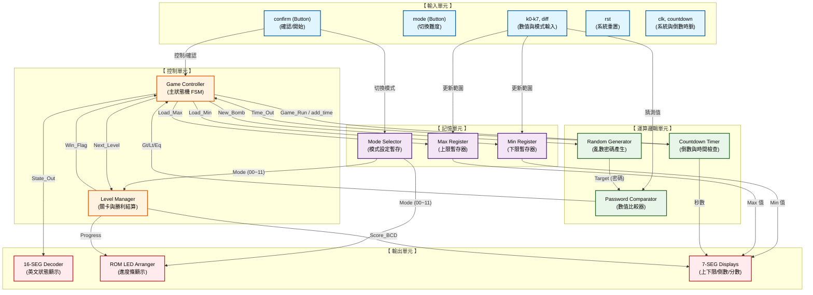

# 拆彈遊戲 電路架構圖 (Architecture Block Diagram)

這份架構圖將系統分為：輸入單元、控制單元、記憶單元、運算邏輯單元與輸出單元。
您可以使用支援 Mermaid 的 Markdown 編輯器 (如 VSCode, Obsidian) 或貼到 [Mermaid Live Editor](https://mermaid.live/) 來預覽並匯出成簡報用的圖片。



### 如何使用這張圖放到簡報？
1. 複製上方 ```mermaid 到 ``` 之間的程式碼。
2. 開啟瀏覽器進入 [Mermaid Live Editor](https://mermaid.live/)。
3. 將程式碼貼在左側編輯區，右側就會立刻生成像簡報上那樣標準且分類清晰的方塊圖！
4. 點擊 `Actions` -> `Download PNG` 即可匯出高畫質圖片貼進 PPT。
